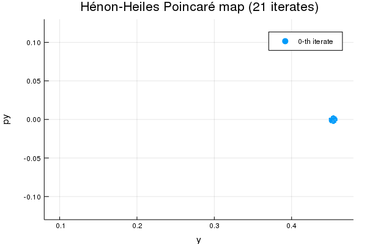

# [Poincaré maps](@id rootfinding)

In this example, we shall illustrate how to construct a Poincaré map associated
with the surface of section ``x=0``, ``\dot x>0``, for ``E=0.1025`` for the
[Hénon-Heiles system](https://en.wikipedia.org/wiki/Hénon–Heiles_system). This is
equivalent to find the roots of an appropriate function `g(t, x, dx)`. We
illustrate the implementation using many initial conditions (Monte
Carlo like implementation), and then compare the results
with the use of [jet transport techniques](@ref jettransport).


## Monte Carlo simulation

The Hénon-Heiles system is a 2-dof Hamiltonian system used to model the (planar)
motion of a star around a galactic center. The Hamiltonian is given by
``H = (p_x^2+p_y^2)/2 + (x^2+y^2)/2 + \lambda (x^2y-y^3/3)``, from which the
equations of motion can be obtained; below we concentrate in the case ``\lambda=1``.

```@example poincare
# Hamiltonian
V(x,y) = 0.5*( x^2 + y^2 )+( x^2*y - y^3/3)
H(x,y,p,q) = 0.5*(p^2+q^2) + V(x, y)
H(x) = H(x...)

# Equations of motion
function henonheiles!(dq, q, p, t)
    x, y, px, py = q
    dq[1] = px
    dq[2] = py
    dq[3] = -x-2y*x
    dq[4] = -y-(x^2-y^2)
    nothing
end
nothing # hide
```

We set the initial energy, which is a conserved quantity; `x0` corresponds
to the initial condition, which will be properly adjusted to be in
the correct energy surface.
```@example poincare
# initial energy and initial condition
const E0 = 0.1025
x0 = [0.0, 0.45335, 0.0, 0.0]
nothing # hide
```

In order to be able to generate (random) initial conditions with the appropriate
energy, we write a function `px`, which depends on `x`, `y`, `py` and
the energy `E` that returns the value of `px>0` for which the initial
condition `[x, y, px, py]` has energy `E`:
```@example poincare
# px: select px0>0 such that E=E0
px(x, E) = sqrt(2(E-V(x[1], x[2]))-x[4]^2)

# px!: in-place version of px; returns the initial condition
function px!(x, E)
    mypx = px(x, E)
    x[3] = mypx
    return x
end

# run px!
px!(x0, E0)
```

Let's check that the initial condition `x0` has actually energy equal to
`E0`, up to roundoff accuracy:
```@example poincare
H(x0)
```

The scalar function `g`, which may depend on the time `t`, the vector of dependent
variables `x` and even the velocities `dx`, defines the surface of section by
means of the condition `g(t, x, dx) == 0`. This function `g` should return a
variable of type `eltype(x)`. In the particular case that the user wishes to
discard a particular crossing (or crossings), the function `g` must then return
a `nothing` value, as will be demonstrated below.

For the present example, we are looking for crossings through the surface ``x=0``,
which corresponds to `g(dx, x, p, t) = x[1]`. But since we are looking only for the
crossings through ``x=0`` which also satisfy ``\dot x > 0``, we have to define
`g` in such a way that the crossing is discarded *only* if ``\dot x < 0``. One
way to achieve this, is to define `g` such that if ``\dot x > 0`` then `g`
returns the value of `x[1]`; otherwise, if ``\dot x < 0``, then `g` returns a
`nothing` value.

Therefore, we define (following again the convention of `DifferentialEquations.jl`) the function `g` as
```@example poincare
# x=0, px>0 section
function g(dx, x, p, t)
    px_ = constant_term(x[3])
    # if px > 0...
    if px_ > zero(px_)
        # ...return x
        return x[1]
    else
        #otherwise, discard the crossing
        return nothing
    end
end
nothing # hide
```

!!! note
    Note that in the definition of `g` we want to make sure that we only take the
    "positive" crossings through the surface of section ``x=0``; hence the
    `if...else...` block.

We initialize some auxiliary arrays, where we shall save the solutions:
```@example poincare
# number of initial conditions
nconds = 100
tvSv = Vector{Vector{Float64}}(undef, nconds)
xvSv = Vector{Matrix{Float64}}(undef, nconds)
gvSv = Vector{Vector{Float64}}(undef, nconds)
x_ini = similar(x0)
nothing # hide
```

We generate `nconds` random initial conditions in a small neighborhood around
`x0` and integrate the equations of
motion from `t0=0` to `tmax=135`, using a polynomial of order 25 and absolute
tolerance `1e-25`:
```@example poincare
using TaylorIntegration

for i in 1:nconds
    rand1 = rand()
    rand2 = rand()
    x_ini .= x0 .+ 0.005 .* [0.0, sqrt(rand1)*cos(2pi*rand2), 0.0, sqrt(rand1)*sin(2pi*rand2)]
    px!(x_ini, E0)

    tv_i, xv_i, tvS_i, xvS_i, gvS_i = taylorinteg(henonheiles!, g, x_ini, 0.0, 135.0,
        25, 1e-25, maxsteps=30000);
    tvSv[i] = vcat(0.0, tvS_i)
    xvSv[i] = vcat(transpose(x_ini), xvS_i)
    gvSv[i] = vcat(0.0, gvS_i)
end
nothing # hide
```

We generate an animation with the solutions
```@example poincare
using Plots
poincare_anim1 = @animate for i=1:21
    scatter(map(x->x[i,2], xvSv), map(x->x[i,4], xvSv), label="$(i-1)-th iterate",
        m=(1,stroke(0)), ratio=:equal)
    xlims!(0.08, 0.48)
    ylims!(-0.13, 0.13)
    xlabel!("y")
    ylabel!("py")
    title!("Hénon-Heiles Poincaré map (21 iterates)")
end
gif(poincare_anim1, "poincareanim1.gif", fps = 2);
nothing # hide
```



## [Jet transport](@id jettransport2)

Now, we illustrate the use of jet transport techniques in the same example,
that is, we propagate a neighborhood around `x0`, which will be plotted
in the Poincaré map. We first define the vector of small
increments of the phase space variables, `xTN`; we fix the maximum order
of the polynomial expansion in these variables to be `4`. Then,
`x0TN` is the neighborhood in the 4-dimensional phase space around ``x0``.
```@example poincare
xTN = set_variables("δx δy δpx δpy", numvars=length(x0), order=4)
x0TN = x0 .+ xTN
nothing # hide
```

As it was shown above, ``x0`` belongs to the energy surface
``H(x0) = E_0 = 0.1025``; yet, as it was defined above, the set of phase
space points denoted by `x0TN` includes points that belong to other
energy surfaces. This can be noticed by computing `H(x0TN)`
```@example poincare
H(x0TN)
```
Clearly, the expression above may contain points whose energy is different from
`E0`. As it was done above, we shall fix the `px` component of `x0TN` so
*all* points of the neighborhood are in the same energy surface.
```@example poincare
px!(x0TN, E0) # Impose that all variations are on the proper energy shell!
H(x0TN)
```
We notice that the coefficients of all monomials whose order is not zero are
very small, and the constant_term is `E0`.

In order to properly handle this case, we need to extend the definition of
`g` to be useful for `Taylor1{TaylorN{T}}` vectors.
```@example poincare
#specialized method of g for Taylor1{TaylorN{T}}'s
function g(dx::Array{Taylor1{TaylorN{T}},1}, x::Array{Taylor1{TaylorN{T}},1},
        p, t) where {T<:Number}
    px_ = constant_term(constant_term(x[3]))
    if px_ > zero( T )
        return x[1]
    else
        return nothing
    end
end
nothing # hide
```

We are now set to carry out the integration.
```@example poincare
tvTN, xvTN, tvSTN, xvSTN, gvSTN = taylorinteg(henonheiles!, g, x0TN, 0.0, 135.0, 25, 1e-25, maxsteps=30000);
nothing # hide
```

We define some auxiliary arrays, and then make an animation with the results for plotting.
```@example poincare
#some auxiliaries:
xvSTNaa = Array{Array{TaylorN{Float64},1}}(undef, length(tvSTN)+1 );
xvSTNaa[1] = x0TN
for ind in 2:length(tvSTN)+1
    whatever = xvSTN[ind-1,:]
    xvSTNaa[ind] = whatever
end
tvSTNaa = union([zero(tvSTN[1])], tvSTN);

myrnd  = 0:0.01:1
npoints = length(myrnd)
ncrosses = length(tvSTN)
yS = Array{Float64}(undef, ncrosses+1, npoints)
pS = Array{Float64}(undef, ncrosses+1, npoints)

myrad=0.005
ξy = @. myrad * cos(2pi*myrnd)
ξp = @. myrad * sin(2pi*myrnd)

for indpoint in 1:npoints
    yS[1,indpoint] = x0[2] + ξy[indpoint]
    pS[1,indpoint] = x0[4] + ξp[indpoint]
    mycond = [0.0, ξy[indpoint], 0.0, ξp[indpoint]]
    for indS in 2:ncrosses+1
        temp = evaluate(xvSTNaa[indS], mycond)
        yS[indS,indpoint] = temp[2]
        pS[indS,indpoint] = temp[4]
    end
end

poincare_anim2 = @animate for i=1:21
    scatter(map(x->x[i,2], xvSv), map(x->x[i,4], xvSv), marker=(:circle, stroke(0)),
        markersize=0.01, label="Monte Carlo")
    plot!(yS[i,:], pS[i,:], width=0.1, label="Jet transport")
    xlims!(0.09,0.5)
    ylims!(-0.11,0.11)
    xlabel!("y")
    ylabel!("py")
    title!("Poincaré map: 4th-order jet transport vs Monte Carlo")
end
gif(poincare_anim2, "poincareanim2.gif", fps = 2);
nothing # hide
```


The next animation is the same as before, adapting the scale.
```@example poincare
poincare_anim3 = @animate for i=1:21
    scatter(map(x->x[i,2], xvSv), map(x->x[i,4], xvSv), marker=(:circle, stroke(0)),
        markersize=0.01, label="Monte Carlo")
    plot!(yS[i,:], pS[i,:], width=0.1, label="Jet transport")
    xlabel!("y")
    ylabel!("py")
    title!("Poincaré map: 4th-order jet transport vs Monte Carlo")
end
gif(poincare_anim3, "poincareanim3.gif", fps = 2);
nothing # hide
```

